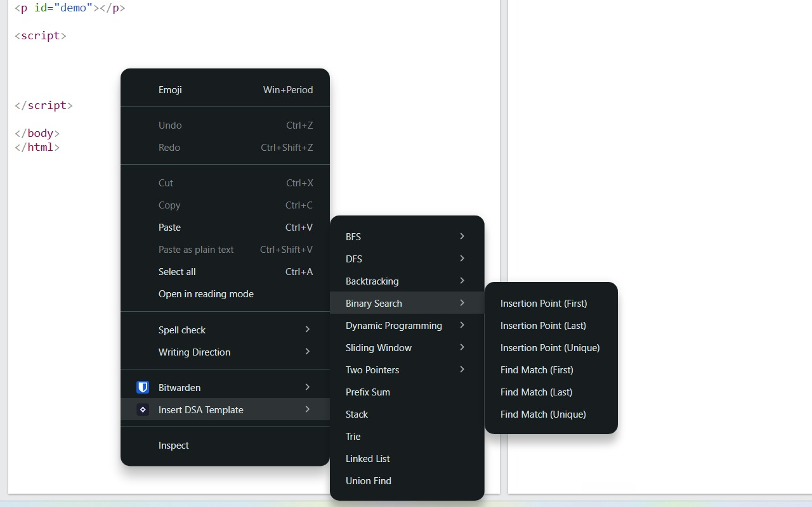

# DSA Templates

Algorithm and data structure templates, plus a Chrome extension that inserts them via right-click.

## [Install from the Chrome Web Store](https://chromewebstore.google.com/detail/dsa-templates/ollnhakcihdpbakabcdgagaciipklehd)

---



## Chrome Extension

### Setup

```bash
npm run build
```

This generates `extension/icons/` and `extension/templates.js` from the source files in `templates/`.

### Load in Chrome

1. Go to `chrome://extensions`
2. Enable **Developer mode** (top-right toggle)
3. Click **Load unpacked** and select the `extension/` folder

### Usage

Right-click any editable field → **Insert DSA Template** → pick a category and template.

## Adding or editing templates

Edit the `.js` files under `templates/`, then run `npm run build` and reload the extension in Chrome.
