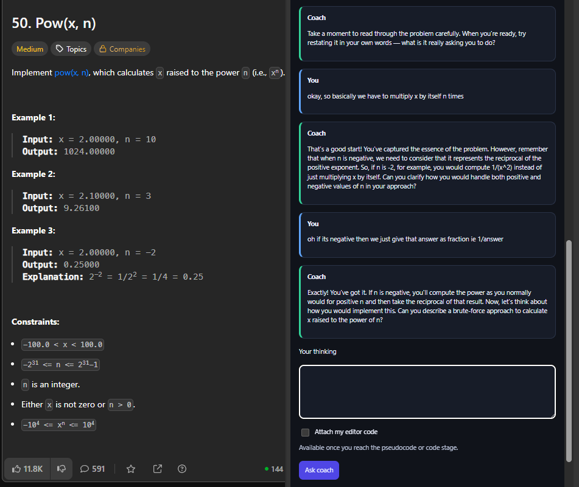

# Art of the Extension

Algorithm templates plus a progressive, bring-your-own-key DSA problem-solving coach.

## [Install from the Chrome Web Store](https://chromewebstore.google.com/detail/dsa-templates/ollnhakcihdpbakabcdgagaciipklehd)

---



## Chrome Extension

### Setup

```bash
npm run build
```

This generates `extension/icons/` and `extension/templates.js` from the source files in `templates/`.

### Load in Chrome

1. Go to `chrome://extensions`
2. Enable **Developer mode** (top-right toggle)
3. Click **Load unpacked** and select the `extension/` folder

### Usage

Right-click any editable field → **Insert DSA Template** → pick a category and template.

To start a coaching session, open a LeetCode problem and either click the extension icon or right-click the page/selected text → **Coach me through this problem**. The panel previews the captured problem text; confirm it before it is sent to your provider. The coach asks about recognition, approaches, complexity, and edge cases before gradually revealing hints, pseudocode, and code.

### AI key safety

Chrome 116 or newer is required for coaching. Open **Extension settings** to save an OpenAI API key. Session-only storage is the default. Persistent storage is opt-in, local to the device, and restricted to trusted extension contexts when Chrome supports it. Use a spend-capped key. API keys are never included in prompts, panel state, or template insertion requests.

Only the problem text you review and confirm is transmitted to OpenAI for a coaching reply. See the [privacy policy](store-assets/privacy-policy.md) and the [provider decision](docs/decisions/0001-provider-byok.md).

## Adding or editing templates

Edit the `.js` files under `templates/` or `coaching-knowledge.json`, then run `npm run build` and reload the extension in Chrome.
